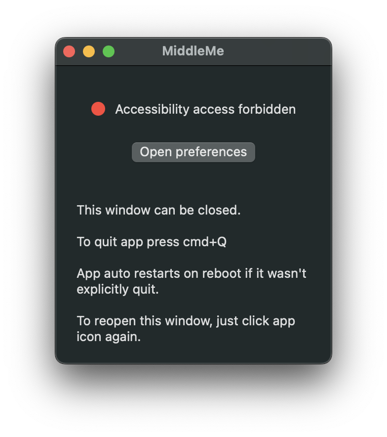
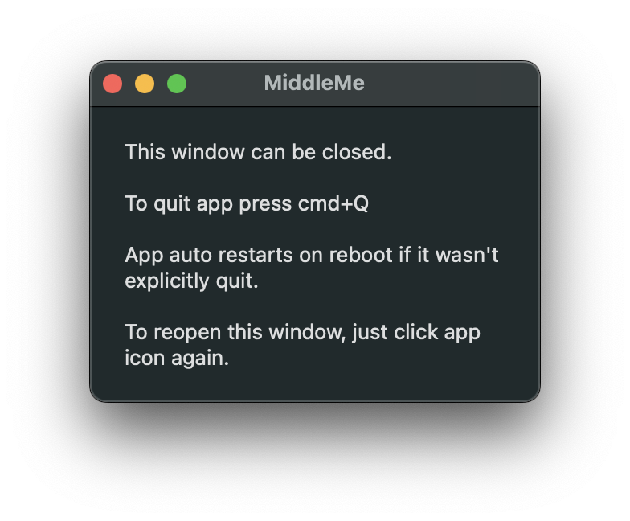

# MiddleMe


Simple app to make trackpad treat triple tap as middle click

## Installation

### Direct download

App can be installed from by downloading zip from [Release Page](https://github.com/Reeywhaar/middleme/releases)

### With Homebrew

```bash
brew tap reeywhaar/tap
brew install reeywhaar/tap/middleme
```

### With curl

Download the release zip and install the app to `/Applications`:

```bash
cd /tmp && \
curl -L -o MiddleMe.zip https://github.com/Reeywhaar/middleme/releases/latest/download/MiddleMe.zip && \
unzip -o -q MiddleMe.zip && \
rm -rf /Applications/MiddleMe.app && \
mv MiddleMe.app /Applications/
```

## Screenshots




