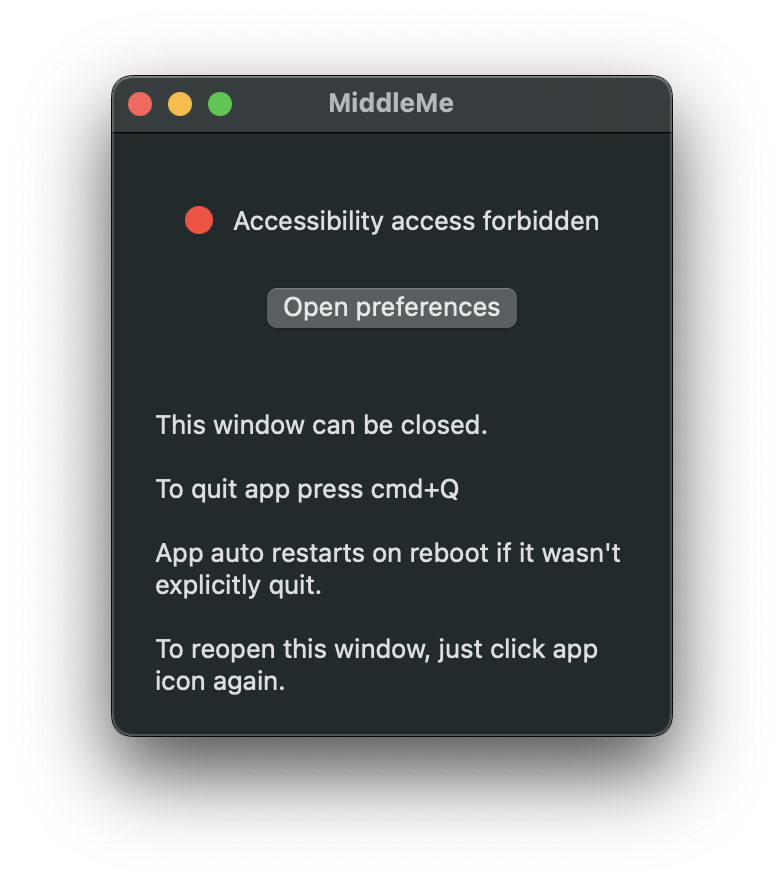

# MiddleMe


Simple app to make trackpad treat triple tap as middle click

## Installation

App can be installed from by downloading zip from [Release Page](https://github.com/Reeywhaar/middleme/releases) or with **HomeBrew**

```
brew tap reeywhaar/tap
brew install reeywhaar/tap/middleme
```

## Screenshots




